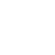

# Cleanify Brand

Repositori ini memiliki file-file terkait *branding* dari Cleanify.

## Spesifikasi

### Simbol/Ikon

Simbol *tong sampah* yang digunakan berasal dari [`trash-fill`](https://icons.getbootstrap.com/icons/trash-fill/) dari Bootstrap Icons.

### Font

*Font* yang digunakan adalah Segoe UI dengan *weight* bold/700.

### Warna

Warna yang digunakan adalah `#1b955c`.

## Preview

### Bentuk persegi

| Keterangan | Gambar |
| - | - |
| Normal | 
| Maskable | 
| Maskable | 

### Bentuk panjang

| Keterangan | Gambar |
| - | - |
| Normal | 
| Maskable | 
| Maskable | 

